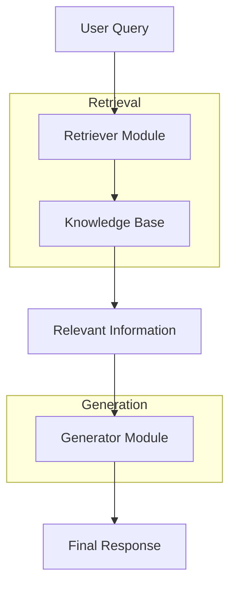

# RAG - Retrieval-Augmented Generation

## What is RAG in AI?

RAG, or Retrieval-Augmented Generation, is an approach that combines two core components:

* Retriever: Retrieves relevant information from an external knowledge base or dataset.
* Generator: Generates a coherent response using the retrieved information.

The goal of RAG is to augment a generative language model with retrieved information, enabling it to provide accurate, up-to-date, and contextually relevant responses.

## How RAG Works

Query Input: A user provides a query.

* Retriever:
The query is sent to a retriever module.
The retriever searches a knowledge base (e.g., documents, embeddings, databases) for the most relevant pieces of information.
Typically uses algorithms like dense retrieval (e.g., via embeddings) or sparse retrieval (e.g., BM25).
* Generator:
The retrieved information is passed to a generative language model (like GPT).
The model integrates this external knowledge with its internal understanding to craft a detailed, coherent response.
* Output:
The final response is presented to the user, enriched with the retrieved content.
This architecture enables the model to answer questions more effectively, especially when the query requires external, domain-specific, or up-to-date information.

## Diagram of how RAG works

